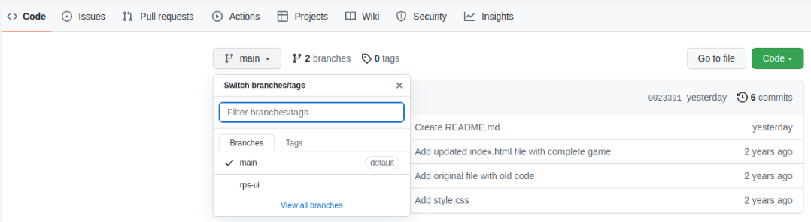

# Rock Paper Scissors
### [The Odin Project](https://www.theodinproject.com/lessons/foundations-rock-paper-scissors)

**Assignment**

Don’t forget to commit early & often! You can [reference the Commit Message lesson here](https://www.theodinproject.com/paths/foundations/courses/foundations/lessons/commit-messages)!

1. Start a new Git repo for your project.

2. Create a blank HTML document with a script tag (Hint: it is best practice to link an external .js file). This game is going to be played completely from the console, so don’t worry about putting anything else in there.

3. Your game is going to play against the computer, so begin with a function called ```getComputerChoice``` that will randomly return either ‘Rock’, ‘Paper’ or ‘Scissors’. We’ll use this function in the game to make the computer’s play. *Tip: use the console to make sure this is returning the expected output before moving to the next step!*

4. Write a function that plays a single round of Rock Paper Scissors. The function should take two parameters - the ```playerSelection``` and ```computerSelection``` - and then return a string that declares the winner or tie of the round like so: ```"You Lose! Paper beats Rock"```

    * Make your function’s playerSelection parameter case-insensitive (so users can input ```rock```, ```ROCK```, ```RocK``` or any other variation).

Important note: you want to ```return``` the results of this function call, not ```console.log()``` them. You’re going to use what you return later on, so let’s test this function by using console.log to see the results:

")

6. Write a NEW function called ```playGame()```. Use the previous function *inside* of this one to play a five round game that keeps score and reports a winner or loser at the end.

* You have not officially learned how to “loop” over code to repeat function calls… if you already know about loops from somewhere else (or if you feel like doing some more learning) feel free to use them. If not, don’t worry! Just call your ```playRound``` function 5 times in a row. Loops are covered in the next lesson.

* At this point you should be using console.log() to display the results of each round and the winner at the end.

* Use ```prompt()``` to get input from the user. [Read the docs here if you need to](https://developer.mozilla.org/en-US/docs/Web/API/Window/prompt).

* Feel free to re-work your previous functions if you need to. Specifically, you might want to change the return value to something more useful.

* Feel free to create more “helper” functions if you think it would be useful.

<br><br>

# Revisiting Rock Paper Scissors
### [The Odin Project](https://www.theodinproject.com/lessons/foundations-revisiting-rock-paper-scissors)

**Assignment**
1. Set up a new branch on your previous Rock Paper Scissors repo

    * Since we’ll be making a UI for our Rock Paper Scissors game, make a new branch and change to it with the command git checkout -b rps-ui.

    * You are now working in the ```rps-ui``` branch, locally. However, this branch does not exist in your remote repo yet. If you go to your github repo page, you’ll see that you only have 1 branch, which would be ```main```. Let’s push this new branch to your remote repo with the command ```git push origin rps-ui```. Now, you’ll see two branches in your GitHub repository! You can select the new branch on GitHub using the dropdown branch selector shown in the screenshot below.

        

    * Make sure you are on the ```rps-ui``` branch. You can check this, with the ```git branch``` command. The branch you are currently on will have an (*)asterisk next to it. If you’re in another branch for some reason, change to ```rps-ui``` with the command ```git checkout rps-ui```. Now you’re all set to work on your new feature! Note: You can add files, commit to this branch, and push changes to your repo, just like you would with the main branch. Everything is the same except when you push the changes, you’d use ```git push origin rps-ui``` instead of ```git push origin main```, since we’re pushing to our new branch.

2. In our UI, the player should be able to play the game by clicking on buttons rather than typing their answer in a prompt.

    * For now, remove the logic that plays exactly five rounds.

    * Create three buttons, one for each selection. Add an event listener to the buttons that call your ```playRound``` function with the correct ```playerSelection``` every time a button is clicked. (you can keep the ```console.log```s for this step)

    * Add a ```div``` for displaying results and change all of your ```console.log```s into DOM methods.

    * Display the running score, and announce a winner of the game once one player reaches 5 points.
    
    * You will likely have to refactor (rework/rewrite) your original code to make it work for this. That’s OK! Reworking old code is an important part of a programmer’s life.

3. Once you’re all done with your UI and made sure everything’s satisfactory, ensure all of your changes are committed to the ```rps-ui``` branch with ```git status``` before continuing.

4. Now let’s take a look at how we can merge the changes from our ```rps-ui``` branch back to our ```main``` branch.

    * Checkout the branch we want to merge INTO i.e. ```main``` with the command ```git checkout main```.

    * Now let’s merge our ```rps-ui``` branch into ```main```, our current branch, with ```git merge rps-ui```.

    * If everything goes fine, our ```rps-ui``` branch is now successfully merged with main! Use ```git log``` and you’ll see all the commits you’ve made to your feature branch on top of the commits you made to the main branch. Now for our final step!

    * Let’s push our ```main``` branch into our remote repo by running ```git push origin main``` . Go to your GitHub repo and you’ll see that our ```main``` branch will have all the changes and commits you made to the ```rps-ui``` branch. Congratulations! You’ve successfully pushed your first feature into your production branch!

    * Now that we have all our code in the main branch, we don’t really need our ```rps-ui``` branch anymore. Let’s do some cleanup, both locally and in the remote repo. Delete the branch from our local repo with ```git branch -d rps-ui``` and also delete it from the remote repo on GitHub with ```git push origin --delete rps-ui```. Congrats, we’re all done with our cleanup!

5. Make sure to publish the project on GitHub Pages and add a live preview link in the project lesson.